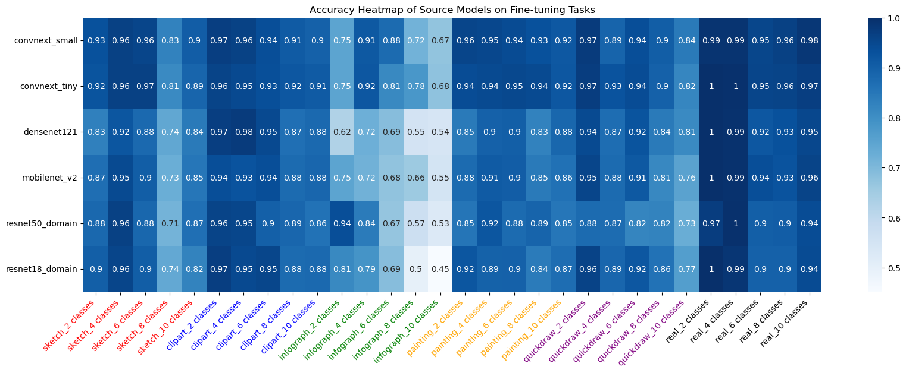

# Transferability Predition for Model Recommendation

## Overview
This repository is dedicated to the study and evaluation of pretrained model (Source model) transferability across a diverse set of tasks (Target datasets). We use metadata of models and datasets, along with training history records, to predict the transferability of models on various datasets. This resource aims to facilitate research into optimizing pre-trained models for specific tasks by accurately predicting and evaluating their transferability.

## Repository Contents

- **Model Metadata (`source_model_meta_data.csv`)**: Contains metadata for each model, detailing aspects such as architecture, input size, model capacity, complexity, pre-trained datasets, and performance metrics.
- **Dataset Metadata (`target_dataset_meta_data.csv`)**: Includes metadata for various datasets, describing features like the number of classes, categories, sample size, and domain/modality specifics.
- **Training Records (`record_domainnet_10_270.csv`)**: Historical records of training sessions, stored in CSV format, providing insights into the training dynamics and outcomes.
- **Transferability Scores (`LogME.csv`)**: A matrix of transferability scores across multiple models and tasks, facilitating comparative studies and benchmarking.
- **Partially visualization (`./images/transferability_matrix.jpg`)**: A graphical representation of the transferability relationships between different models and tasks.

## Model Metadata

Each model in our repository is characterized by the following attributes:

- **Architecture**: Design of the model crucial for feature capture and generalization.
- **Input Size**: Dimensionality of model inputs, impacting information processing capabilities.
- **Model Capacity**: Number of parameters, indicative of learning and representational power.
- **Model Complexity**: Memory consumption used as a proxy for complexity.
- **Pre-trained Dataset**: The dataset on which the model was initially trained, affecting its biases and pre-existing knowledge.
- **Model Performance**: Empirical measure of model accuracy on benchmark datasets.

Below is a table describing some of the models included in this repository:

| Architecture Family | Model Name        | # of Parameters | acc@1 (on ImageNet-1K) | GFLOPS |
|---------------------|-------------------|-----------------|------------------------|--------|
| convnext            | convnext_small    | 50,223,688      | 83.616                 | 8.68   |
| convnext            | convnext_tiny     | 28,589,128      | 82.52                  | 4.46   |
| densenet            | densenet121       | 7,978,856       | 74.434                 | 2.83   |
| ...                 | ...               | ...             | ...                    | ...    |
| resnet              | resnet101         | 68,883,240      | 78.468                 | 11.4   |
| resnet              | resnet50          | 25,557,032      | 80.858                 | 4.09   |
| resnet              | resnet18          | 11,689,512      | 69.758                 | 1.81   |
| resnet              | wide_resnet50_2   | 44,549,160      | 81.886                 | 7.8    |

## Dataset Metadata

Datasets are described by:

- **Number of Predefined Classes**: Reflects the categorical complexity.
- **Categories**: High-level description crucial for domain-specific tasks.
- **Sample Size**: Total number of samples, important for training efficacy.
- **Domain**: Specifies the particular field or environment that the dataset represents, which can influence model performance and applicability.
- **Labels**: Detailed descriptions of the labels within the dataset, providing insights into the types of outputs the model needs to handle and their possible relationships.

Below is a table describing some of the datasets included in this repository:

| Dataset Name  | Num Predefined Classes | Domain   | Categories | Labels                         | Train Sample Size |
|---------------|------------------------|----------|------------|--------------------------------|-------------------|
| 1_painting_2  | 10                     | painting | 2          | saxophone, flying_saucer       | 20                |
| 2_painting_2  | 10                     | painting | 2          | leaf, jail                     | 20                |
| 3_painting_2  | 10                     | painting | 2          | flying_saucer, jail            | 20                |
| ...           | ...                    | ...      | ...        | ...                            | ...               |
| 269_clipart_32| 50                     | clipart  | 32         | tornado, harp, ..., birthday_cake | 1471           |
| 270_clipart_32 | 50                     | clipart  | 32         | spoon, flying_saucer, ..., paint_can | 1494       |

## Training Records

In the context of pre-trained model selection, the primary criterion focuses on evaluating the transferability of a source model to a target task. Consider the source task \(M_S = \{(m_i, )\}_{i=1}^m\), target task \(D_T = \{(x_T^i, y_T^i)\}_{i=1}^n\), and the model \(M = (\theta, h_s)\) trained on the source task \(D_S\), where \(\theta\) represents the feature extraction layer for input \(x_s\), and \(h_s\) denotes the decoder layer that maps the extracted features to the label \(y_s\). This approach employs the widely used transfer learning strategy known as "Retrain head", which retains the parameters of the source task's feature extraction layer \(\theta\) while finetuning to optimize the parameters of the target task's decoder readout function \(h_t\). Empirical transferability is defined by the average accuracy of the source model when applied to the target task.


This equation represents the expected accuracy of the model \(M\), when its pretrained feature extractor \(\theta\) is combined with a newly trained decoder \(h_t\) on the target dataset \(D_T\).


### Partial Visualization of Transferability Matrix

Below is a graphical representation of the transferability relationships between different models and tasks:




## Embedding

The `embedding.ipynb` notebook is designed to preprocess the metadata of models and datasets, performing tasks such as one-hot encoding and normalization to prepare the data for further analysis.

### Source Embedding

The source embedding process uses the target dataset metadata to generate an embedding file, `Model_embedding.npy`. This file contains the processed embeddings of model metadata which are used in assessing the transferability of models to various target tasks.

**Command to generate source embedding:**
```bash
python embedding.ipynb --input target_metadata.csv --output Model_embedding.npy
```

### Source Embedding
Use target data through embedding.ipynb to generate the Model_embedding.npy file.


### Target Embedding
Use source data through embedding.ipynb to generate the Dataset_embedding.npy file.

### Foundation Model Embedding
We utilize foundation model embeddings (e.g., BERT, GPT-2, or CLIP Text Encoder, here provied BERT) to capture the **domain** and **label** textual characteristics of datasets, enhancing the predictive accuracy of our transferability models. FM_embedding.npy

## Additional MS Score

Incorporates model scoring metrics like LogME, LEEP, and H-Score as edge features in our graphs, serving as indicators of model transferability.

## Baseline Method

- **Linear Regression** LR.py

For any queries or further information, please contact davechenhello@gmail.com


